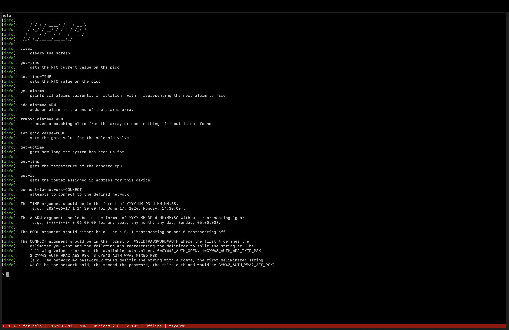
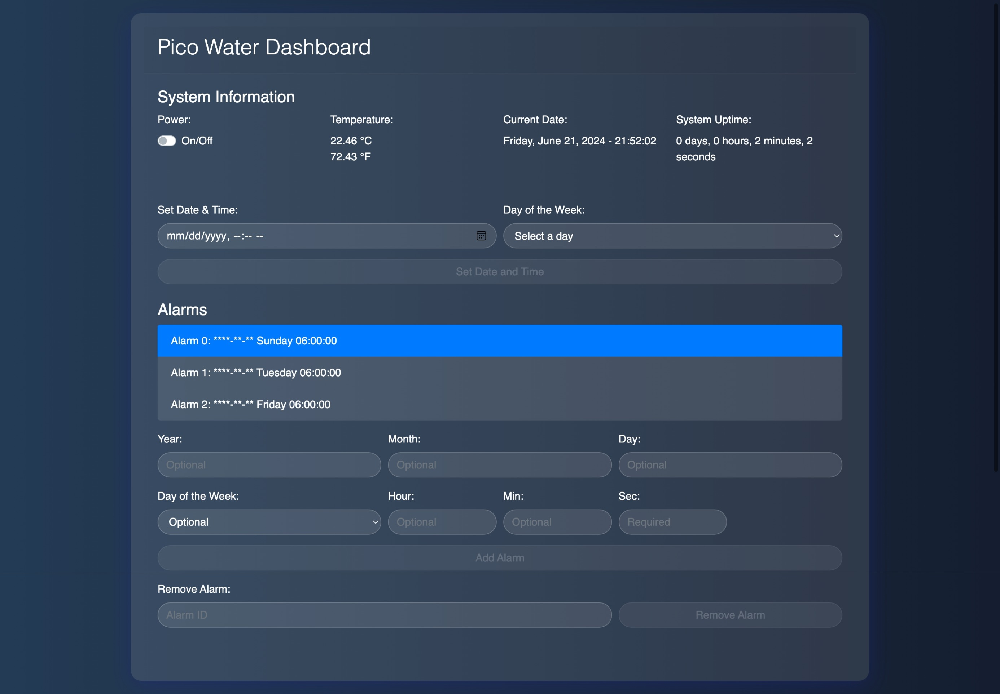

# Pico Water

This project automates the watering of your garden using a Raspberry Pi Pico. It leverages the Pico's Real-Time Clock (RTC) to set alarms for watering schedules and controls a solenoid valve to manage water flow.

You can check out a video walkthrough of the code for version 1.0.0 on my YouTube channel [here](https://youtu.be/9xKd_dKpwEM?si=SkYf2hw4Hm9uImdd).

[](https://youtu.be/9xKd_dKpwEM)

## Screenshots
### USB Communications for regular pico


### USB Communications for pico w


### Webserver for Pico W


## Table of Contents
- [Screenshots](#screenshots)
- [Features](#features)
- [Requirements](#requirements)
- [Setup](#setup)
- [Usage](#usage)
- [Project Structure](#project-structure)
- [License](#license)

## Features
- Automated garden watering using a solenoid valve.
- Configurable watering schedules via RTC alarms.
- Supports both Raspberry Pi Pico and Pico W (with Wi-Fi functionality).
- Supports USB communication to control pico
- PICO_W only:
   - Web Server that allows remote control of the system

## Requirements
- Raspberry Pi Pico or Pico W
- Solenoid valve
- Necessary electronic components (wires, resistors, etc.)
- CMake 3.13 or later
- Raspberry Pi Pico SDK 1.5.0 or later
- PICO_W only: 
   - Python installed on your system and accessible on the PATH via python3 or python

## Setup
1. Clone this repository:
   ```bash
   git clone https://github.com/yourusername/pi_water_pico_project.git
   cd pi_water_pico_project
   ```

2. Initialize the Pico SDK submodule:
   ```bash
   git submodule update --init
   ```

3. Configure your project:
   ```bash
   mkdir build
   cd build
   cmake ..

   # or if you're using pico_w
   # make sure \" is included in the wifi_ssid and wifi_password to have quotes inside the quotes
   cmake -DPICO_BOARD=pico_w -DWIFI_SSID="\"your_ssid\"" -DWIFI_PASSWORD="\"your_password\"" ..
   ```

4. Build the project:
   ```bash
   make -j4
   ```

## Usage
1. Flash the compiled program to your Raspberry Pi Pico or Pico W.
2. Connect the solenoid valve to the specified GPIO pin (default is pin 16).
3. Set the RTC to the current date and time in `definitions.h`:
   ```c
   #define TODAYS_YEAR 2024
   #define TODAYS_MONTH 5
   #define TODAYS_DAY 25
   #define TODAYS_DOTW SATURDAY
   #define TODAYS_HOUR 1
   #define TODAYS_MIN 30
   #define TODAYS_SEC 0
   ```
4. Define your watering schedule in `initial_alarms.h`:
   ```c
   datetime_t INITIAL_ALARMS[] = {
      { 
         .year = DATETIME_IGNORE, 
         .month = DATETIME_IGNORE, 
         .day = DATETIME_IGNORE, 
         .dotw = SUNDAY, 
         .hour = 6, 
         .min = 0, 
         .sec = 0 
      },
      { 
         .year = DATETIME_IGNORE,
         .month = DATETIME_IGNORE, 
         .day = DATETIME_IGNORE, 
         .dotw = TUESDAY, 
         .hour = 6, 
         .min = 0, 
         .sec = 0 
      },
      { 
         .year = DATETIME_IGNORE, 
         .month = DATETIME_IGNORE, 
         .day = DATETIME_IGNORE, 
         .dotw = FRIDAY, 
         .hour = 6, 
         .min = 0, 
         .sec = 0 
      }
   };
   ```
5. Define how long you want the watering to run for (default is 300000):
    ```c
    #define SOLENOID_RUNTIME_MS 300000
    ```
6. Control the Pico via USB
  * connect a usb to the pico
  * run the following command in a terminal  `minicom -b 115200 -D /dev/ttyACM0 -c on`
    * device could also be /dev/ttyACM1, /dev/ttyACM2, etc.
  * type `help` to get started

## Project Structure
- **.github/**: Contains GitHub workflow checks for PRs
- **build/**: Compiled source directory.
- **html_files**: HTML files that will be compiled by `makefsdata.py` and sourced into `htmldata.c`
  - **index.shtml**: Main index.shtml entry that will run when the pico_w web server is started
- **screenshots**: Screenshots of the application
  - **usb_comms_pico.png**: Screenshot of the help menu for the regular pico
  - **usb_comms_pico_w.png**: Screenshot of the help menu for the pico w
  - **webserver_pico_w.jpeg**: Screenshot of the web application running on the pico w webserver
- **src/**: Source code directory.
  - **alarms.c**: Holds and defines all of the application alarms
  - **alarms.h**: Headers for `alarms.c`
  - **cgi.c**: Get requests the HTML files call for updating system information
  - **cgi.h**: Headers for `cgi.c`
  - **definitions.h**: Configuration and definitions.
  - **helpers.c**: Various helper funcions used throughout the application
  - **helpers.h**: Headers for `helpers.c`
  - **initial_alarms.h**: Holds all of the initial alarms a user wants the program to start with
  - **logger.c**: Handles printing color and arguments to console
  - **logger.h**: Headers for `logger.c`
  - **main.c**: Main application code.
  - **ssi.c**: Directives that allow the server to dynamically include content in web pages before they are sent to the client
  - **ssi.h** Headers for `ssi.c`
  - **sys_info.c**: Common system information shared between `usb_comms` and `ssi`
  - **sys_info.h**: Headers for `sys_info.c`
  - **usb_comms.c**: USB Communication between a host and the pico
  - **usb_comms.h**: Headers for `usb_comms.c`
- **.gitignore**: files git should ignore when making commits
- **CHANGELOG.md**: History of project versions and changes
- **CMakeLists.txt**: CMake configuration file.
- **htmldata.c**: data converted from html to raw hex
- **lwipopts.h**: lwip options used for pico_w server
- **makefsdata.py**: python script that converts html_data to raw hex
- **pico_sdk_import.cmake**: Pico SDK import script.
- **README.md**: Project setup and information

## Special Thanks
Thank you to the "Learn Embedded Systems" YouTube channel for the tutorial on how to make a Simple Web Server in C. 
Make sure to check out their YouTube video that I followed [here](https://youtu.be/C_O0MXGBHsw?si=Nnk5kwAcImsK2u_w)

[](https://youtu.be/C_O0MXGBHsw)

## License
This project is licensed under the MIT License. See the [LICENSE](https://opensource.org/license/mit) file for details.